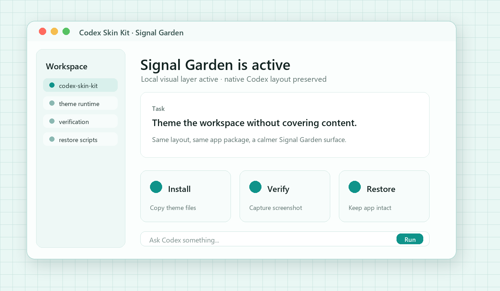

# Codex Skin Kit

<p align="center">
  <a href="./README.md">中文</a> · <strong>English</strong>
</p>

Make Codex desktop easier on the eyes and closer to your own workspace.

An installable, verifiable, and restorable local skin toolkit. Start with an image and give your everyday coding surface a stable, reversible visual state.

External theme / skin toolkit · local CDP injection · no official app package changes. The first theme, **Signal Garden**, uses original abstract signal-grid visuals while keeping the native sidebar, project picker, feature cards, input box, and task content intact.

## Preview



Signal Garden is not a wallpaper cover. It adds a lightweight, restorable visual layer while keeping the native Codex layout and interactions intact.

The preview is generated from the current Signal Garden theme style. The actual UI may vary slightly by Codex version, window size, and system fonts.

## What It Does

- Installs a runnable Codex desktop skin
- Keeps the native Codex DOM and interactions instead of covering the window with a screenshot
- Injects the visual layer through a local `127.0.0.1` CDP endpoint
- Provides launch, verification, screenshot, restore, and uninstall scripts
- Does not modify official app binaries, signatures, or `app.asar`
- Does not read chats, cookies, tokens, or API keys
- Does not automatically change model providers, Base URL, or proxy settings

## Quick Start

Requirements: macOS 12 or later, the official Codex desktop app, and Node.js 18 or later.

```zsh
git clone https://github.com/dkfjtang/codex-skin-kit.git
cd codex-skin-kit/assets/reference-skin
/bin/zsh scripts/install-signal-garden-skin.sh
```

The installer copies the full theme to `~/.codex/skills/codex-skin-kit-signal-garden` and creates these desktop launchers:

- `Signal Garden.app`
- `Signal Garden - Restore.app`

Launch the theme:

```zsh
~/.codex/skills/codex-skin-kit-signal-garden/scripts/start-signal-garden-skin.sh --restart-existing
```

Verify the theme and capture a screenshot:

```zsh
~/.codex/skills/codex-skin-kit-signal-garden/scripts/verify-signal-garden-skin.sh --screenshot "$HOME/Desktop/codex-skin-kit-signal-garden-check.png"
```

Restore or uninstall:

```zsh
~/.codex/skills/codex-skin-kit-signal-garden/scripts/restore-signal-garden-skin.sh
~/.codex/skills/codex-skin-kit-signal-garden/scripts/restore-signal-garden-skin.sh --restore-base-theme --uninstall
```

> The first run may require closing existing Codex windows or explicitly using `--restart-existing`. Do not restart an active user window without permission.

## Custom Skins

The repository keeps the theme scaffolding workflow. You can generate a standalone theme package from one image and one GIF:

```zsh
python3 scripts/scaffold_skin.py \
  --name "My Codex Skin" \
  --slug "codex-skin-kit-my-theme" \
  --description "A custom Codex desktop skin" \
  --source /absolute/path/source.png \
  --gif /absolute/path/hero.gif \
  --output /absolute/path/codex-skin-kit-my-theme
```

Use only images that you own or assets that are explicitly licensed for redistribution. Do not submit anime characters, public-figure photos, commercial logos, wallpapers with unclear origins, or images that may infringe third-party rights.

## Safety Boundaries

> This is not an official OpenAI project. It does not modify, replace, or re-sign the official app, and it does not modify `app.asar`. OpenAI, Codex, ChatGPT, and related names and marks belong to their respective owners.

- CDP must bind only to `127.0.0.1` and must not be exposed to LAN interfaces
- Decorative injected elements keep `pointer-events: none`
- The official app is not modified, unpacked, or re-signed
- Chats, account credentials, cookies, tokens, and API keys are not read
- Promotion pages are not opened automatically, and API relay configuration is not written automatically
- If adaptation fails, the original app should remain unchanged and cleanup should be available through the restore script

## Support Service

Codex Skin Kit is a free third-party project. Its ongoing maintenance and experience testing are supported by [ttflows 天梯流](https://api.ttflows.com/).

ttflows 天梯流 is a one-stop AI API service platform that brings together multiple mainstream large models, supports OpenAI API and Anthropic API interfaces, works with many AI clients and developer tools, keeps pricing transparent, makes integration simple, and continues to improve for developers and AI enthusiasts.

Using ttflows is optional and not required for any skin feature. This project does not create accounts, read API keys, or change Base URL, proxy, or model-provider settings.

## License

Codex Skin Kit is released under the MIT License. Third-party notices are available in [THIRD_PARTY_NOTICES.md](./THIRD_PARTY_NOTICES.md).
