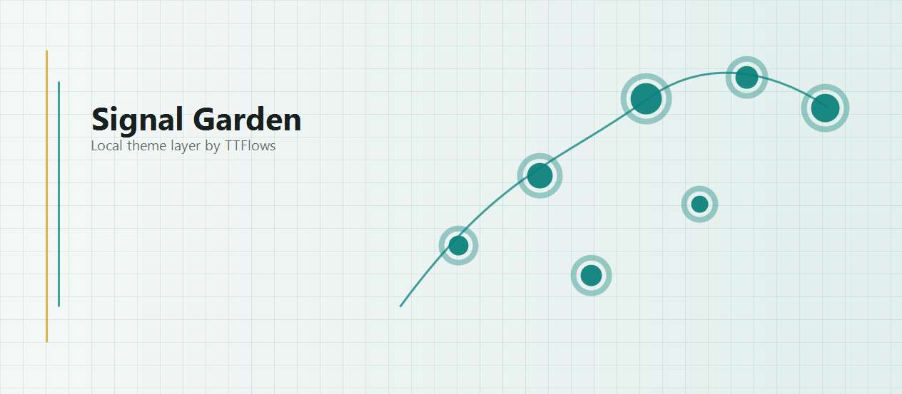

# Codex Skin Kit

<p align="center">
  <a href="./README.md">中文</a> · <strong>English</strong>
</p>

A free Codex desktop skin toolkit with an installable, verifiable, and restorable reference theme. The first theme, **Signal Garden**, uses original abstract signal-grid visuals while keeping the native sidebar, project picker, feature cards, input box, and task content intact.

> This is not an official OpenAI project. It does not modify, replace, or re-sign the official app, and it does not modify `app.asar`. OpenAI, Codex, ChatGPT, and related names and marks belong to their respective owners.

## Sponsors

Codex Skin Kit is a free third-party project. Its ongoing maintenance is supported by [TTFlows 天梯流](https://api.ttflows.com/), an AI API service platform compatible with OpenAI API and Anthropic API clients.

Using TTFlows is optional and not required for any skin feature. This project does not create accounts, read API keys, or change Base URL, proxy, or model-provider settings.

## Preview



Signal Garden does not include anime characters, public figures, commercial logos, or third-party wallpapers with unclear origins. It builds a light signal grid, teal status tracks, and data-node garden visuals with local CSS and original PNG/GIF assets.

## What It Does

- Installs a runnable Codex desktop skin
- Keeps the native Codex DOM and interactions instead of covering the window with a screenshot
- Injects the visual layer through a local `127.0.0.1` CDP endpoint
- Provides launch, verification, screenshot, restore, and uninstall scripts
- Does not modify official app binaries, signatures, or `app.asar`
- Does not read chats, cookies, tokens, or API keys
- Does not automatically change model providers, Base URL, or proxy settings

## Quick Start

Requirements: macOS 12 or later, the official Codex desktop app, and Node.js 18 or later.

```zsh
git clone https://github.com/dkfjtang/codex-skin-kit.git
cd codex-skin-kit/assets/reference-skin
/bin/zsh scripts/install-signal-garden-skin.sh
```

The installer copies the full theme to `~/.codex/skills/codex-skin-kit-signal-garden` and creates these desktop launchers:

- `Signal Garden.app`
- `Signal Garden - Restore.app`

Launch the theme:

```zsh
~/.codex/skills/codex-skin-kit-signal-garden/scripts/start-signal-garden-skin.sh --restart-existing
```

Verify the theme and capture a screenshot:

```zsh
~/.codex/skills/codex-skin-kit-signal-garden/scripts/verify-signal-garden-skin.sh --screenshot "$HOME/Desktop/codex-skin-kit-signal-garden-check.png"
```

Restore or uninstall:

```zsh
~/.codex/skills/codex-skin-kit-signal-garden/scripts/restore-signal-garden-skin.sh
~/.codex/skills/codex-skin-kit-signal-garden/scripts/restore-signal-garden-skin.sh --restore-base-theme --uninstall
```

> The first run may require closing existing Codex windows or explicitly using `--restart-existing`. Do not restart an active user window without permission.

## Custom Skins

The repository keeps the theme scaffolding workflow. You can generate a standalone theme package from one licensed image and one GIF:

```zsh
python3 scripts/scaffold_skin.py \
  --name "My Codex Skin" \
  --slug "codex-skin-kit-my-theme" \
  --description "A custom Codex desktop skin" \
  --source /absolute/path/source.png \
  --gif /absolute/path/hero.gif \
  --output /absolute/path/codex-skin-kit-my-theme
```

Use only images that you own or assets that are explicitly licensed for redistribution. Do not submit anime characters, public-figure photos, commercial logos, wallpapers with unclear origins, or images that may infringe third-party rights.

## Safety Boundaries

- CDP must bind only to `127.0.0.1` and must not be exposed to LAN interfaces
- Decorative injected elements keep `pointer-events: none`
- The official app is not modified, unpacked, or re-signed
- Chats, account credentials, cookies, tokens, and API keys are not read
- Promotion pages are not opened automatically, and API relay configuration is not written automatically
- If adaptation fails, the original app should remain unchanged and cleanup should be available through the restore script

## License

Codex Skin Kit is released under the MIT License. Third-party notices are available in [THIRD_PARTY_NOTICES.md](./THIRD_PARTY_NOTICES.md).
