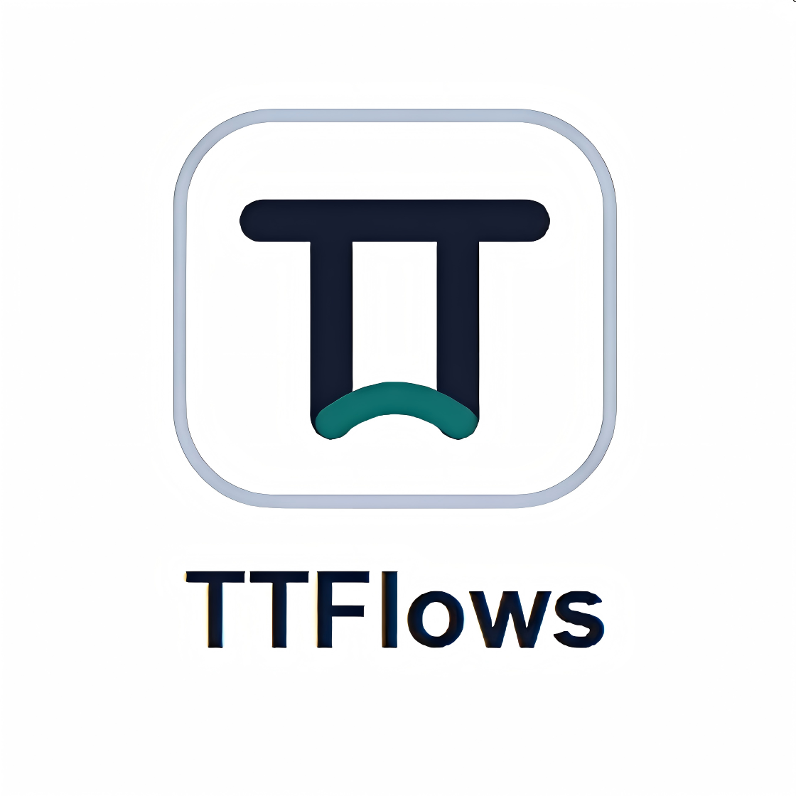

# Codex Skin Kit

<p align="center">
  <strong>中文</strong> · <a href="./README.en.md">English</a>
</p>

让 Codex 桌面端更顺眼，也更像你的工作台。

这是一套可安装、可验证、可恢复的本地皮肤工具；从一张图片开始，给日常编码界面换一种稳定、可回退的视觉状态。

外部主题 / 换肤工具 · 本机 CDP 注入 · 不改官方安装包。首版主题 **Signal Garden** 使用原创抽象信号网格视觉，同时保留原生侧边栏、项目选择器、功能卡、输入框和任务内容。

## 效果预览


Signal Garden 的目标不是盖一张壁纸，而是在保留 Codex 原生布局和交互的前提下，给工作区加上轻量、可恢复的视觉层。

上图是基于当前 `signal-garden-skin.css` 生成的主题样式预览，用来说明这套皮肤的目标效果。真正的运行截图请在 macOS + 官方 Codex 桌面环境中通过验证脚本生成：

```zsh
~/.codex/skills/codex-skin-kit-signal-garden/scripts/verify-signal-garden-skin.sh --screenshot "$HOME/Desktop/codex-skin-kit-signal-garden-check.png"
```

拿到实机截图后，建议用它替换 README 主图；在此之前，不把当前图片标成“真实运行截图”。

## 它能做什么

- 安装一套本地 Codex 皮肤目录到 `~/.codex/skills/codex-skin-kit-signal-garden`
- 创建 `Signal Garden.app` 和 `Signal Garden - Restore.app` 两个桌面启动器
- 通过 `127.0.0.1` 本机 CDP 把 CSS 和装饰层注入到官方 Codex 桌面窗口
- 保留 Codex 原生 DOM 和交互，不做整窗截图覆盖，不替换应用包
- 用 `verify-signal-garden-skin.sh` 检查注入状态，并可导出当前窗口截图
- 用 `restore-signal-garden-skin.sh` 移除皮肤、停止注入进程，并可卸载桌面启动器
- 不读取对话、Cookie、Token 或 API Key，不自动修改模型供应商、Base URL 或代理配置

## 快速开始

要求：macOS 12 或更高版本、官方 Codex 桌面版、Node.js 18 或更高版本。脚本会查找 Bundle ID 为 `com.openai.codex` 的官方应用，并只绑定本机 `127.0.0.1` 调试端口。

```zsh
git clone https://github.com/dkfjtang/codex-skin-kit.git
cd codex-skin-kit/assets/reference-skin
/bin/zsh scripts/install-signal-garden-skin.sh
```

安装器会把完整主题复制到 `~/.codex/skills/codex-skin-kit-signal-garden`，并在桌面创建：

- `Signal Garden.app`
- `Signal Garden - Restore.app`

启动主题：

```zsh
~/.codex/skills/codex-skin-kit-signal-garden/scripts/start-signal-garden-skin.sh --restart-existing
```

验证主题并截图：

```zsh
~/.codex/skills/codex-skin-kit-signal-garden/scripts/verify-signal-garden-skin.sh --screenshot "$HOME/Desktop/codex-skin-kit-signal-garden-check.png"
```

恢复或卸载：

```zsh
~/.codex/skills/codex-skin-kit-signal-garden/scripts/restore-signal-garden-skin.sh
~/.codex/skills/codex-skin-kit-signal-garden/scripts/restore-signal-garden-skin.sh --restore-base-theme --uninstall
```

> 首次运行可能需要关闭已打开的 Codex 窗口，或显式使用 `--restart-existing`。不要在未经用户同意时重启正在使用的窗口。

## 自定义皮肤

仓库保留主题脚手架能力，可基于一张图片和一个 GIF 生成独立主题包。脚手架会复制运行脚本、替换主题名称/slug，并生成可安装的皮肤目录；它不会自动保证任何图片都能得到完美布局，生成后仍建议运行安装和验证截图。

```zsh
python3 scripts/scaffold_skin.py \
  --name "My Codex Skin" \
  --slug "codex-skin-kit-my-theme" \
  --description "A custom Codex desktop skin" \
  --source /absolute/path/source.png \
  --gif /absolute/path/hero.gif \
  --output /absolute/path/codex-skin-kit-my-theme
```

请只使用你拥有使用权的图片或明确允许再分发的素材。不要提交动漫角色、公众人物照片、商业 Logo、来源不明壁纸或可能侵犯第三方权利的图片。

## 安全边界

> 非 OpenAI 官方项目。不修改、替换、重签官方应用，也不修改 `app.asar`。OpenAI、Codex、ChatGPT 及相关名称和标识归各自权利人所有。

- CDP 仅绑定 `127.0.0.1`，不得暴露到局域网接口
- 装饰性注入元素保持 `pointer-events: none`
- 不修改、不解包、不重签官方应用
- 不读取聊天内容、账号凭证、Cookie、Token 或 API Key
- 不自动打开推广页面，不自动写入中转站配置
- 适配失败时应保持原应用不变，并可通过恢复脚本清理

## 支持服务

<p align="center">
  <a href="https://api.ttflows.com/">
    
  </a>
</p>

<p align="center">
  <strong>ttflows 天梯流</strong><br>
  一站式 AI API 服务平台，给各类 AI 客户端和开发工具提供简单稳定的模型接入体验。
</p>

<p align="center">
  <a href="https://api.ttflows.com/"><strong>访问 ttflows 天梯流 →</strong></a>
</p>

Codex Skin Kit 是免费分享的第三方项目，持续维护与体验测试由 ttflows 天梯流提供支持服务。

ttflows 天梯流是一站式 AI API 服务平台，汇聚多种主流大模型，支持 OpenAI API 和 Anthropic API 接口，兼容各类 AI 客户端和开发工具，价格透明、接入简单、持续优化，欢迎开发者和 AI 爱好者体验交流。

使用 ttflows 不是任何皮肤功能的必要条件。本项目不会自动创建账户、读取 API Key，也不会自动修改 Base URL、代理或模型供应商配置。

## License

Codex Skin Kit is released under the MIT License. Third-party notices are available in [THIRD_PARTY_NOTICES.md](./THIRD_PARTY_NOTICES.md).
