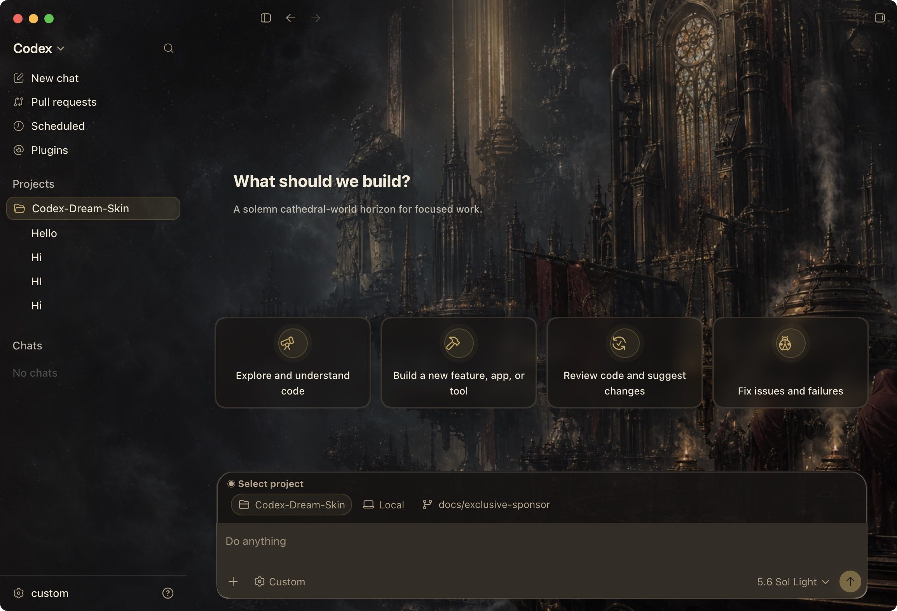

# Codex Skin Kit

<p align="center">
  <strong>中文</strong> · <a href="./README.en.md">English</a>
</p>

<p align="center">
  <strong>给 Codex 桌面端换一张会呼吸的脸。</strong><br>
  外部主题 / 换肤工具 · 本机 CDP 注入 · 不改官方安装包
</p>

<p align="center">
  一张图，一种心情 · 写代码，也要有氛围感
</p>

<p align="center">
  非 OpenAI 官方产品。不修改 <code>.app</code> / <code>app.asar</code> / WindowsApps。
</p>

## 支持服务

<p align="center">
  <a href="https://api.ttflows.com/">
    
  </a>
</p>

<p align="center">
  <strong>ttflows 天梯流</strong><br>
  <sub>一站式 AI API 服务平台 · 简单接入 · 透明价格 · 持续优化</sub>
</p>

<p align="center">
  <a href="https://api.ttflows.com/"><strong>访问 ttflows 天梯流 →</strong></a>
</p>

ttflows 天梯流是一站式 AI API 服务平台，汇聚多种主流大模型，支持 OpenAI API 和 Anthropic API 接口，兼容各类 AI 客户端和开发工具，价格透明、接入简单、持续优化，欢迎开发者和 AI 爱好者体验交流。

换肤与 API 配置互相独立。使用 ttflows 不是任何皮肤功能的必要条件；本项目不会自动创建账户、读取 API Key，也不会自动修改 Base URL、代理或模型供应商配置。

## 项目致谢

本项目参考并使用了 [Fei-Away/Codex-Dream-Skin](https://github.com/Fei-Away/Codex-Dream-Skin) 的开源实现，感谢上游作者和社区贡献者。相关许可与来源说明见 [`NOTICE.md`](./NOTICE.md) 与 [`THIRD_PARTY_NOTICES.md`](./THIRD_PARTY_NOTICES.md)。

## 实测精选预设

### Gothic Void Crusade / 哥特虚空远征

上游当前实测精选预设之一，支持通过主题切换脚本启用。

<p align="center">
  <br>
  <sub>真实 Codex 首页注入效果（上游预览）</sub>
</p>

macOS 安装后可从「已保存主题」直接切换，也可以运行：

```bash
~/.codex/codex-dream-skin-studio/scripts/switch-theme-macos.sh \
  --id preset-gothic-void-crusade
```

### 桥本有菜 / Arina Hashimoto

该预设来自上游仓库，截图中的侧栏、卡片、项目选择和输入框是 Codex 原生控件。公开使用或再分发人物、IP、素材相关内容前，请自行确认肖像、素材与商标权利。

<p align="center">
  <br>
  <sub>浅色 · 真实注入截图（上游预览）</sub>
</p>

<p align="center">
  <br>
  <sub>暗色 · 真实注入截图（上游预览）</sub>
</p>

## 它能做什么

- **真实可交互**：侧栏、建议卡、项目选择、输入框都是原生控件，不是整窗假截图贴上去
- **真实背景层**：一张 16:9 纯壁纸连续铺满整窗，首页突出氛围，任务页自动降低干扰
- **可换图**：换一张喜欢的纯背景，自适应焦点、安全区和配色后变成你的主题
- **可存主题**：macOS 菜单栏与 Windows 系统托盘都能保存/切换本地主题
- **可恢复**：一键还原官方外观
- **相对安全**：本机回环 CDP 注入，不改官方二进制与签名

## 快速开始

仓库按平台放置脚本：

| 平台 | 目录 | 入口 |
|------|------|------|
| Windows | [`windows/`](./windows/) | `scripts/install-dream-skin.ps1` → `start-dream-skin.ps1` |
| Apple Silicon / Intel Mac | [`macos/`](./macos/) | 双击 `Install Codex Dream Skin.command` |

Windows 首次使用：

```powershell
powershell -ExecutionPolicy Bypass -File .\windows\scripts\install-dream-skin.ps1
powershell -ExecutionPolicy Bypass -File .\windows\scripts\start-dream-skin.ps1
```

macOS 首次使用：

```bash
cd macos
./scripts/install-dream-skin-macos.sh --no-launch
./scripts/start-dream-skin-macos.sh
```

更多说明：

- Windows：[`windows/README.md`](./windows/README.md)
- macOS：[`macos/README.md`](./macos/README.md)
- 路径对照：[`docs/platforms.md`](./docs/platforms.md)
- 参考生图模板：[`docs/reference-background-prompt-guide.md`](./docs/reference-background-prompt-guide.md)
- 项目记录：[`docs/PROJECT.md`](./docs/PROJECT.md)

## 安全边界

- CDP 只绑定 `127.0.0.1`
- 不修改官方安装目录、官方二进制、代码签名或 `app.asar`
- 不自动写入 API Key / Base URL / 代理 / 模型供应商配置
- 换肤功能和中转服务互相独立

## 许可与声明

- 本仓基于 [Fei-Away/Codex-Dream-Skin](https://github.com/Fei-Away/Codex-Dream-Skin) 整理，遵循上游 MIT 许可证
- 上游许可见 [`macos/LICENSE`](./macos/LICENSE)，本仓补充说明见 [`NOTICE.md`](./NOTICE.md) 与 [`THIRD_PARTY_NOTICES.md`](./THIRD_PARTY_NOTICES.md)
- 非 OpenAI 官方产品；Codex、OpenAI、ChatGPT 及相关名称和标识归各自权利人所有
- 随仓预设和效果图中的人物 / IP / 素材仅作主题示意；商用或公开再分发请自行确认授权

---

挑一张图，把 Codex 换成今天想要的样子。
